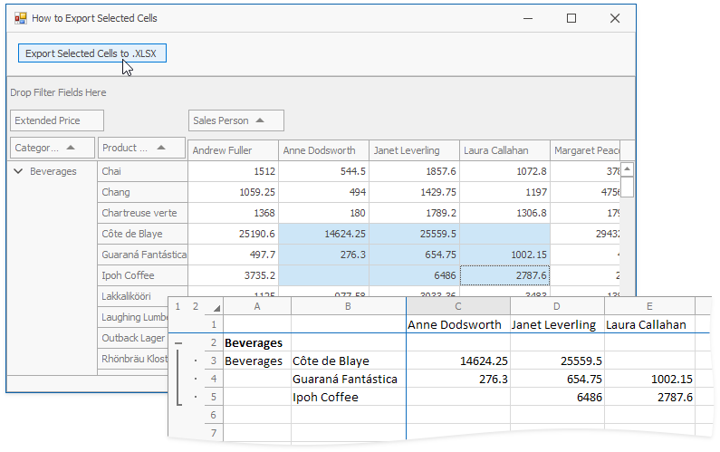

<!-- default badges list -->

<!-- default badges end -->
<!-- default file list -->
*Files to look at*:

* [Form1.cs](./CS/HowToExportSelectedCells/Form1.cs) (VB: [Form1.vb](./VB/HowToExportSelectedCells/Form1.vb))
* [Program.cs](./CS/HowToExportSelectedCells/Program.cs) (VB: [Program.vb](./VB/HowToExportSelectedCells/Program.vb))
<!-- default file list end -->
# How to Export Selected Cells

To include only selected cells in the resulting XLSX document, handle the [PivotGridControl.CustomFieldValueCells](https://docs.devexpress.com/WindowsForms/DevExpress.XtraPivotGrid.PivotGridControl.CustomFieldValueCells) event.

